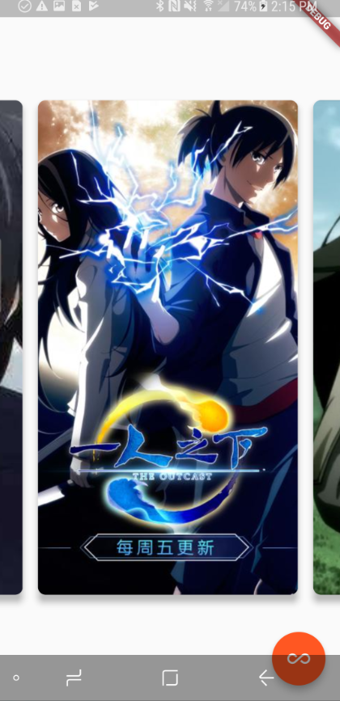

    <h1>Flutter Tutorial</h1>
    
    
    
    

## Getting Started

For help getting started with Flutter, view our online
[documentation](https://flutter.io/).

## Instructions
### 1. First App Pages.
There are 7 steps under lib/1-FirstAppPages.  
run each dart file (eg: 1_hello_world.dart)  

#### In this section, covered following items:  
- Created a Flutter app from the ground up.  
- Written Dart code.  
- Leveraged an external, third party library.  
- Used hot reload for a faster development cycle.  
- Implemented a stateful widget, adding interactivity to your app.  
- Created a lazily loaded, infinite scrolling list displayed with a ListView and ListTiles.  
- Created a route and added logic for moving between the home route and the new route.  
- Learned about changing the look of your app’s UI using Themes.  

### 2. Build Layouts.   
There are several dart files under lib/2-BuildLayoutsInFlutterPages.   
Most of them are the examples from Flutter IO.   

#### In this section, covered following items:  
- Build layout.  
- Add interactivity.  
- Container.
- Gridview.
- Listview.
- Stack.
- Card.

### 3. Cook Book.   
There are several sections under lib/3-CookBookPages.   
All of them are from Google Flutter IO. [Cookbook](https://flutter.io/cookbook/)

#### In this section, covered following items:  
- Design basics.
- Images.
- Lists.
- Handling Gestures.
- Navigation.
- Animation.
- Networking.
- Persistence.
- Form.

### 4. Sample Catalog.   
There are 4 sections under lib/4-SampleCatalogPages.   
All of them are from Google Flutter IO. Each sample demonstrates how a few Flutter widgets can be put together to implement a meaningful user interface. 
[SampleCatalog](https://flutter.io/catalog/samples/)

#### In this section, covered following items:  
- AnimatedList.
- AppBar with bottom widget.
- A typical AppBar with a title, actions, and an overflow dropdown menu..
- ExpansionTiles.

### 5. Build Beautiful UI.
For this section, we are using Google Firebase to do a chat app.
You can check the code under lib/5-BuildBeautifulUIs.
Or you can check my separate repo: [Flutter_Firebase_Demo](https://github.com/yidinghe/Flutter_Firebase_Demo)

### 6. Others.   
Anytime I saw some interesting implementation by Flutter, I will put it here.
run each dart file see what has beem implemented. (eg: 3_PageView_Gradient.dart)  

